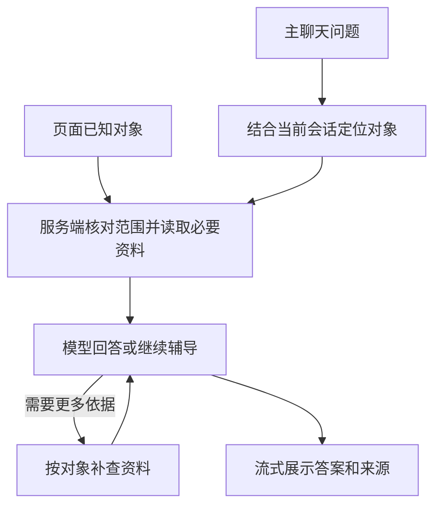
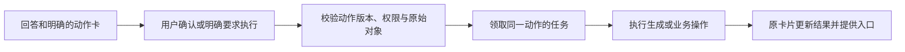
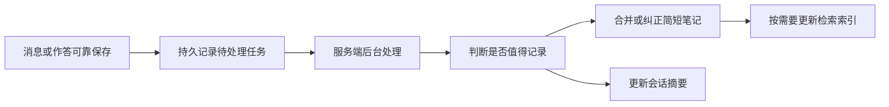

# AI 上下文与后台记忆更新设计

状态：设计稿 v1.1，2026-09-05。尚未实现；当前只修改本文。v1.1 补充确认卡、课堂讲解生成与任务结果接续。

目标：页面里的 AI 和主聊天，都能拿到当前问题对应的真实资料；记忆的提取、合并、写入、摘要与索引维护全部在后台完成。

## 1. 第一版的决定

1. 先完成上下文传递，保留现有课程回答 agent。专项 agent 和 handoff 后续按需要增加。
2. 页面传递明确对象和筛选条件，服务端校验权限、读取数据，再交给模型。页面已经知道的对象不让模型重新猜。
3. 必要上下文在第一次模型调用前准备好；更多历史和资料通过简洁的读取工具补充。
4. 日历、题目、作答、成绩和任务进度保留在各自业务记录里。记忆只记录需要从历史互动中延续的少量信息。
5. 回答模型不承担记忆诊断，不等待记忆更新完成。
6. 验收看实际发送给模型的资料及其来源，不能只看工具定义或回答中自称“已查看”。
7. 生成课堂讲解等动作同时保存待执行内容与来源上下文。确认后执行这份确定的任务，一次确认足够；状态与结果由业务记录决定。

## 2. 当前基础与缺口

以下是代码审查结论，不代表已经完成线上数据或真实模型请求验证。

| 项目 | 已有基础 | 本设计要补齐的部分 |
| --- | --- | --- |
| 教师、学生课程聊天 | 共用课程回答实现，按身份提供工具 | 第一次调用前注入当前页面的明确对象和必要资料 |
| 学生详情页 | 已知学生 ID、课程、时间范围 | 目前只把姓名和时间拼成问题，应传递结构化选择条件 |
| 作答详情 | 页面 API 已读取题干、学生答案、批改结果 | 抽取同一读取服务给聊天使用，支持准确指定某次作答 |
| 班级与个人统计 | 已有学情统计服务 | 保持页面和 AI 的统计范围一致，区分完整统计与抽样证据 |
| 知识点 | 已有课程标签节点及题目关联 | 复用真实标签 ID，按学生与知识点查作答、资料和笔记 |
| 日历 | 可读取当前账号、当前课程、指定日期范围 | 传入页面日期、事件选择和时区，明确课程日程与私人日程的可见范围 |
| 历史会话 | 已有持久消息、会话摘要字段和序号 | 后台更新摘要；按需找回相关会话，而非默认塞入全部历史 |
| 记忆更新 | 笔记本聊天有写入与索引代码，前端也有延迟写入 | 去掉请求内诊断和等待，统一由可靠的服务端任务执行 |
| 确认卡与课堂讲解 | 已有通用学习动作卡和回答下的讲解邀请卡 | 统一上下文绑定、一次确认、后台执行及结果状态，避免只准备提示就标为完成 |

特别注意：当前笔记本聊天在请求开始时可能同步旧记忆，在最终回复前等待记忆写入，写入中又等待索引。仅把数据库写入改成异步仍不满足目标，诊断和旧记录同步也要移出回复过程。

## 3. 页面怎样把上下文交给 AI

### 3.1 页面只提交选择信息

这些字段是接口设计，不要求沿用现有大体积 `CourseChatContext` 请求对象。

| 信息 | 示例字段 | 约束 |
| --- | --- | --- |
| 用户问题与会话 | `message`、`conversationId` | 会话归属由服务端校验 |
| 当前入口 | `surface` | 学生详情、作答详情、知识点、日历、Dashboard、主聊天等；不授予权限 |
| 当前课程 | `courseId` | 指向实际课程实例，不能只使用 CSC148 之类课程名称 |
| 当前对象 | `studentId`、`problemId`、`attemptId`、`topicId`、`notebookId`、`calendarEventId` | 可选字段仅按场景提交；服务端逐项检查关联关系 |
| 当前范围 | 日期起止、时区、允许的筛选条件 | 保留页面实际范围；“最近七天”在服务端只解析一次 |
| 临时模式 | `memoryMode` | 临时会话不进入跨对话记忆更新任务 |

登录用户、角色、课程访问权、题目公开范围由服务端确定。客户端提供的学生姓名、摘要和页面统计不作为权威事实。

未提交的答案草稿、用户选中的文字或附件可以随问题发送，但必须标记为用户提供的内容，并与已提交作答分开。数据内容中的指令不改变系统规则。

### 3.2 各入口的首次上下文

“必需”表示该场景默认在首次模型调用前准备；并不表示每轮都把所有原始历史塞进去。

| 场景 | 必需上下文 | 按问题补充 |
| --- | --- | --- |
| 教师问班级情况 | 课程与日期范围、同页面口径的班级统计、主要困难题目或知识点、少量代表性证据 | 指定学生、某道题的作答、教师日程 |
| 教师问某个学生 | 确定的学生 ID、日期范围、个人统计、近期相关作答概要、可用于教学的相关学习笔记 | 完整作答、相关章节、其他时间段 |
| 教师查看某次作答 | 确定的课程/学生/题目/作答、完整公开题干、此次原答案、批改结果、有关课程规则 | 同一知识点其他作答、相关讲义、已有学习笔记 |
| 学生 Dashboard 问学情 | 当前学生、页面课程范围、实际学习进度、近期作答统计、相关学习笔记 | 自己的近期日程、完整错题、其他课程 |
| 题库讲解 | 当前题目、必要图片/表格、课程作答规则；有选定作答时附该次作答 | 相关课程章节、知识点记录、用户自己的历史作答 |
| 某个知识点 | 当前课程的知识点 ID/名称、关联资料片段、目标学生在相关题目的表现、相关学习笔记 | 更早作答、其他讲法、邻近知识点 |
| 日历页提问 | 当前日期范围和时区、选定事件及当前用户可见的相关日程 | 学习进度、相关任务、其他日期 |

详细规则：

- 统计分母来自对应范围内的业务聚合；挑选三条代表性作答，不得把“三条”描述成全部提交。
- 知识点复用 `CourseProblemTagNode` 和已应用的 `NotebookProblemTagAssignment`。没有可靠关联时返回“关联资料不足”，可用文本搜索补充候选，但不把候选当成确定绑定。
- 学生题库讲解只读取当前有权访问的题面、自己的作答和可展示反馈。隐藏测试与未开放答案不会因 AI 入口获得额外可见性。
- 教师查看学生不会自动获得学生私人日历和私人偏好。课程公开事件、教师自己的日程、学生可共享学情分别执行已有或明确的访问规则。
- Dashboard 跨课程时，先取各课程的小型概览；具体解释再查选中的课程。所有结果注明覆盖的课程范围。
- 页面对象变更后，新请求使用新的对象；旧请求的返回仍绑定原请求 ID，不能显示为新对象的回答。

### 3.3 服务端实际发送的内容

服务端生成一份本轮上下文，包含四项可直接核对的信息：

1. **正在回答谁的什么问题**：身份、课程、对象、日期与筛选条件。
2. **相关资料**：题干、原答案、反馈、日程、统计、资料片段、少量学习笔记。
3. **资料出处**：业务记录 ID、更新时间、必要的页面链接，资料是否节选或抽样。
4. **缺少什么**：没有作答、无可靠知识点关联、资料暂时不可用等。

例如，下面仅展示内容形状，不是实际查询结果：

> 当前问题：解释学生 A 在题目 P 的作答 R 中为什么失败。
> 已确认范围：课程 C，学生 A，选定作答 R，页面选择的日期区间。
> 题目 P：完整公开题干和必要图片。
> 作答 R：学生原答案；批改结果及失败位置。
> 课程讲法：与递归返回值相关的讲义片段及其来源。
> 历史：同知识点上两次相关作答的摘要与 ID，一条仍有效的学习笔记。
> 缺口：没有当前知识点的计时样本。

读取失败与“没有数据”分开。选定作答不存在、身份关联不成立时不生成该作答的诊断；可选历史暂时不可用时，可以基于已有答案解释，并说明缺少历史比较依据。

### 3.4 控制大小与等待

- 固定入口直接确定读取清单，不额外调用一个“上下文规划 agent”。
- 完整题干、选定作答、相关反馈优先保留。超长内容按具体函数、页或段落读取，显式注明覆盖范围，不无声截断再声称分析完整。
- 初始建议：相关笔记最多 5 条、补充历史作答最多 3 次、课程资料先取 1—3 个相关片段。它们是可调的辅助内容上限，不限制统计查询的完整性。
- 班级概览返回聚合统计和少量证据；查看单个学生不应先计算整个班级的完整详情。
- 独立读取在数据库连接池预算内并发，避免串行模型调用，也避免一次请求占满数据库连接。
- 同一请求已读到的资料复用；跨请求缓存必须带用户/课程/对象/筛选范围及数据版本，权限与当前事实仍重新核对。

## 4. 主聊天与页面共用什么

第一版共用上下文准备和数据读取服务，不新增多个必须串行调用的 agent。



主聊天的处理方式：

- “继续讲这道题”沿用当前已确认题目与辅导进度。
- “看看李四最近怎么样”先用课程内搜索确定学生，得到 ID 后使用与学生详情页相同的读取逻辑；存在同名时简短确认。
- 用户明确换人、换题、换课时更新范围，不能让页面旧上下文覆盖用户的新请求；每次切换重新校验。
- 普通问候、文字改写等不读取学情、日历和历史记忆。
- 数据补查使用同一组按对象读取的方法。第一版重点提供作答详情、学生表现、班级概览、日程、课程资料、相关笔记与会话检索；不把领域内部的每个函数都暴露为工具。
- 单个能力已能完成回答时直接输出；跨能力合成或持续控制权转移有实际需求后再加入 handoff。

前端聊天组件只处理输入、当前选择、流式消息、来源和任务结果。它不运行记忆诊断、数据检索规划或 agent 调度。

### 4.1 确认卡也属于本轮上下文

回答之外，模型还可能提出一个动作，例如把当前解释制作成 1—2 页课堂讲解、将复习安排加入日历。确认卡必须对应一份完整的待执行内容；聊天里只有一句“要不要生成”或一个没有对象的按钮，不足以执行。

现有实现有两条课堂入口：`MiniLectureInviteCard` 点击后发起生成；`classroom.propose_temporary_explanation` 的确认处理目前只创建讲解提示，并将动作标为完成，后续仍可能需要点击生成。第一版将两者接入相同执行入口，保留现有卡片呈现，消除“确认后再确认”和“准备提示等于已生成”的状态歧义。

| 交互 | 确认前展示和保存什么 | 点击后的行为 |
| --- | --- | --- |
| 生成课堂讲解 | 基于哪段回答/哪道题、讲解目标、页数与语言；需要时展示当前可用的消耗或耗时估计 | 直接提交讲解生成任务，卡片显示进度；完成后提供查看讲解入口 |
| 生成图片等内容 | 对象、用途、用户可调整的生成要求 | 以确认版本开始对应生成任务 |
| 开始练习或生成练习安排 | 知识点、已选真实题目或明确安排、数量与模式 | 创建或打开对应练习；题库不足时保留缺口，不临时编题冒充题库题 |
| 添加、修改、删除日历 | 具体事件、日期/时区，以及修改前后的差异 | 确定性日历服务执行，检查事件版本后返回实际结果 |
| 选择复习方式 | 讲解、练习等明确选项与当前目标 | 把用户选择作为输入，补齐任务参数；不把这类选择当成已执行完整任务 |
| 用户主动确认记忆候选 | 将记录的简短文字、对象与来源 | 保存确认事件，后台合并笔记；自动记忆更新不产生此类确认卡 |

“查看讲解”“打开已生成练习”等结果入口直接打开已有产物，不再次生成。一个动作需要选择参数时，可以在同一卡片内编辑后执行，不连续弹出多层确认框。

### 4.2 待执行动作保留哪些信息

服务端保存一份动作记录，UI 展示它的可读部分。它是业务任务状态，不是长期记忆。

| 信息 | 目的 |
| --- | --- |
| 动作 ID、类型与版本 | 确定用户确认的究竟是哪一个动作、哪一版内容 |
| 用户、课程、原会话和原消息 | 校验归属，结果回到原入口 |
| 题目、作答、知识点等对象引用 | 沿用本轮已经确认的对象 |
| 原回答与必要来源的固定版本或快照引用 | 后续聊天变化时，生成仍基于用户看到的那段内容 |
| 讲解目标、语言、页数、引导方式等参数 | 明确生成任务；修改参数产生新版本 |
| 确认来源、任务 ID、状态、结果引用 | 区分提出、接受、执行中、完成与失败 |

课堂讲解使用原问题、原回答、相关题干/作答/反馈及必要课程资料。只附与讲解目标相关的笔记和约束，例如“先给提示”。不在确认后重新扫描全班、全部历史或所有记忆，也不只凭动作卡的短摘要重新编写教学内容。

卡片的可读描述与服务端执行参数由同一动作记录生成。客户端确认只提交动作 ID、版本和允许编辑的参数；服务端读取保存的内容，不能信任客户端临时提交的另一份生成正文来替换已确认对象。

服务端仍检查动作类型是否允许、是否需要确认及当前权限，模型不能通过输出 `confirmation: none` 绕过现有确认规则。用户已经明确要求执行、对象和参数也完整时，这条明确指令可以作为确认依据，不再额外要求点击同样的确认框。

### 4.3 一次确认后怎样执行



- 生成讲解、图片等长任务立即返回任务身份，后台执行；原答案已可阅读，其他聊天可以继续。
- 状态按待确认、排队中、执行中、完成、失败/取消/已被新版替代显示。确认成功不等于生成完成；仅准备好提示也不等于产物完成。
- 连续点击、页面刷新、断线重连都返回同一个动作版本的已有任务或结果。由服务端持久的唯一约束保证，不只靠禁用按钮或进程内去重。
- 重试保留原动作、上下文和已完成步骤。明确失败的步骤可以重试；外部生成结果不确定时先查询或恢复已有结果，不能声称内部去重保证第三方绝不会重复计费。
- 取消待确认动作不会启动任务。取消执行中任务先记录请求并停止后续可停止步骤；已完成的产物不因关闭弹窗而删除。
- 原题、原作答、课程权限失效时不能继续执行。日历版本变化导致内容不再匹配时，刷新具体差异再确认；没有改变已确认范围的普通聊天继续不触发重复确认。
- 修改讲解目标或页数生成一个新版本，并替代旧的待确认版本。用户确认哪个版本就执行哪个；正在执行的版本不被后台偷偷改成新参数。
- 生产任务结果使用可持久读取的产物 ID。图片和音频按产物引用加载，不将全部二进制内容写回聊天上下文。现有仅在本地保存媒体的模式需要明确恢复范围，不能假设换设备仍能打开。
- 用户切换会话后，任务继续更新原会话的卡片和任务记录，不把结果附到当前其他会话。任务完成不强行切走当前页面；用户可点击查看讲解，在原教学场景中打开播放器。

### 4.4 后续消息怎样理解确认和任务

本轮上下文可按需带上该会话有关的待确认动作、正在执行任务和已完成产物的简短状态。

- 用户回复“可以”“生成吧”时，只能确认当前会话唯一、明确对应的待确认动作；多个候选或对象不清时简短确认对象，不默认执行所有动作。
- 用户说“改成一页”时，修改明确对应的待确认讲解参数；“改成一页，生成吧”可直接确认修改后的版本。
- 用户问“刚才生成的讲解呢”时，读取真实任务状态和产物引用；模型不凭上一轮说过“开始生成”就回答“已经完成”。
- 从另一会话继续任务时，先在用户有权访问的任务中准确定位；旧摘要本身不构成新的执行授权。
- 任务成功之后可产生普通业务事件供后台记忆处理，但“生成成功”或“打开播放器”不证明学生已经掌握知识点。
- 临时会话不因此进入跨对话记忆。用户明确生成的产物可有独立任务记录，保留任务所需的最小来源内容，并在临时入口说明产物的保存范围；不将完整临时聊天转为可召回摘要。

第一版先统一讲解卡和通用课堂动作，之后复用同一动作身份、版本和任务状态规则覆盖日历、练习和图片。前端共用薄的卡片容器，具体内容仍按动作展示，避免把所有业务执行放回聊天组件。

## 5. 记忆只保留简短笔记与会话接续

### 5.1 一条笔记的内容

面对回答模型，统一为“小段文字 + 对象 + 来源”，不再要求它理解现有分层、路由和存储术语。

| 字段 | 用途 |
| --- | --- |
| ID 与归属 | 明确属于哪个用户；按读取者权限决定是否可用于教学 |
| 关联范围 | 课程以及可选知识点、题目或学生对象；跨课程偏好才使用用户范围 |
| 主题 | 同一个范围内稳定识别记录，例如“递归返回值”“先提示再给答案” |
| 正文 | 一小段可直接理解、可由用户修改的文字 |
| 依据 | 原始消息或作答 ID；必要时保留短证据片段 |
| 时间与版本 | 支持新旧判断替换、并发更新和追溯 |
| 可见性与状态 | 私人或允许用于教学；有效、被替代或已删除 |

示例：

> 能独立写出递归终止条件；最近两次作答遗漏对子问题返回值的组合。下一次可先让学生解释每个递归调用返回什么。依据：作答 A、B。

笔记只记录影响后续帮助的信息。询问定义或粘贴题目不足以判定长期薄弱；助手讲解完成不足以判定学生掌握。教师个人的备课意见与学生自己的学习证据分别归属，不能由一次教师提问自动改写学生状态。

日程时间、题目得分、计划完成状态仍读取业务记录。笔记可以引用它们，但不能覆盖它们。新证据出现后改写或淘汰旧判断，避免一直把学生描述成“不懂某知识点”。

存储建议：第一版可复用 `StudyMemory` 保存这份精简笔记，用简单适配器映射必要字段。新回答入口不加载旧的整套分层提示。对象绑定和版本等不足的存储能力在实现时补齐；不以“已经复用旧表”代替这些约束。

### 5.2 跨对话接续

已有会话的 `summaryText` 和 `summaryThroughSequence` 可以承载简短的会话摘要，后台维护“讨论对象、已做什么、待继续什么、原始消息位置”。计划是否完成仍回查计划记录。

新会话默认只读取相关的少量用户笔记。只有用户说“上次”“继续昨天的”等，或者当前任务确实需要历史时，才查询最近相关会话的摘要，再读取必要原文。存在多个候选时确认一次，不自动拼接无关会话。

摘要尚未覆盖的新消息，按摘要序号补读有界增量。增量过大时按对象找最近记录或原文，不临时调用摘要模型阻塞回复。

用户纠正或删除笔记时，先可靠保存用户操作事件；读取时立即优先应用纠正或排除已删除记录。笔记正文合并、摘要修订和索引维护继续在后台执行，不在聊天请求里临时生成新记忆。正在运行的后台任务通过版本与删除标记防止写回旧内容。被删除的来源不再参与重建。重新使用已删除主题，需要新的、明确的用户输入或证据，不能只凭旧任务复活。

临时模式不产生跨对话笔记或可检索会话摘要。独立发生的正式作答仍按作答业务本身保存和处理，不因附近开着临时聊天而改变。

### 5.3 后台更新的完整过程



回复模型不输出记忆诊断，也不等待以上处理。消息保存、作答保存以及轻量待处理事件落库属于正常业务持久化；记忆提取、合并、旧记录补写、摘要压缩与索引构建全部属于后台任务。

建议为在线生产路径使用数据库持久任务表和独立服务端 worker。业务事件与任务记录同事务提交，避免事件已保存但任务丢失。作答事件可在作答完成后处理，会话摘要事件在回复完成或中断状态可靠保存后处理；取消生成不删除已提交的真实作答或消息证据。

后台实现必须具备：

- 按事件 ID 与版本去重；重试同一事件不会重复创建笔记。
- 短事务领取任务并记录租约，模型调用在事务外执行；进程重启后租约过期的任务可重新领取。
- 笔记更新检查版本，同一主题的旧任务不能覆盖较新的用户纠正；冲突时重读最新记录再合并。
- 失败退避重试、有限重试次数和可观察的最终失败状态，用户当前回复不受影响。
- 同一会话短时间内的新消息可以合并处理，已经处理到的消息序号只前进；不为每条短消息单独生成一份长期记忆。
- 回答请求与后台任务有独立的并发、连接和模型调用预算，后台积压不挤占正常聊天。
- 写入前重查来源是否有效、是否为临时模式、目标与来源归属是否匹配。

数据库任务表的并发领取可采用短事务行锁；PostgreSQL 文档明确将 `SKIP LOCKED` 列为多消费者队列表减少锁竞争的用途。租约、幂等与重试仍由本设计额外实现，不能仅依赖这个 SQL 选项。[PostgreSQL SELECT 文档](https://www.postgresql.org/docs/current/sql-select.html)

部署时必须同时提供可实际运行的 worker 与恢复机制。现有浏览器任务队列和进程内 Promise 不作为生产后台保证。纯离线浏览器模式只能持久保存待同步事件，恢复在线并同步后再处理，不承诺浏览器关闭后仍运行模型任务。

## 6. 怎样证明上下文真的送到了

为每个回答保留受权限保护的调试记录：

- 本次问题、页面入口、解析后的对象与实际筛选条件。
- 首次模型调用实际包含的资料及来源 ID，哪些内容被节选、抽样或省略。
- 后续工具调用的参数、返回记录 ID、缺失和失败。
- 上下文准备耗时、模型调用次数、首段有用答案时间、完整答案时间。
- 本轮是否触发后台事件，以及后台处理状态；不包含模型隐藏推理。
- 动作卡对应的对象、参数版本、确认依据、任务状态与产物 ID，实际执行是否与用户确认一致。

普通用户看到简洁的来源和统计范围；完整调试资料按权限限期保留，不对其他学生或无关教师开放。

| 验收场景 | 必须满足 |
| --- | --- |
| 两名同名学生 | 从详情页发问不搜索姓名、不串学生，首次调用带正确学生 ID |
| 同一题有多次作答 | 选中哪次就分析哪次，题干、答案、反馈来自同一个有效关联 |
| 学生切换日期范围 | 页面统计与模型收到的范围一致，时区边界一致 |
| 同名知识点出现在不同课程 | 使用当前课程内的标签关联，不合并为同一个学习状态 |
| 班级有大量提交 | 总统计与证据样本分开，截取证据不改变统计分母 |
| 刚提交就问“我哪里错了” | 直接读取该次作答，不等待后台记忆生成 |
| 新对话继续旧题 | 定位相关会话和题目，补读摘要后的消息，保留实际辅导位置 |
| 后台 worker 停止或模型超时 | 回复完成不受记忆处理影响，待处理任务保留并可恢复 |
| 重放同一事件、乱序完成 | 不重复创建笔记，不覆盖较新的判断与用户纠正 |
| 临时会话或已删除记录 | 不产生或复活跨对话记忆；索引与摘要也遵守该限制 |
| 查询缺少关键资料 | 明确缺口，不用统计概要假装已经读过原答案 |
| 点击生成课堂讲解 | 一次确认后开始实际生成，不再出现同义确认；原答案可继续阅读 |
| 生成期间继续聊其他题 | 生成使用原问题、答案和目标，结果仍绑定原消息 |
| 重复点击或服务重启 | 同一动作版本复用已有任务/产物，不创建重复的内部生成任务 |
| 修改页数、题目内容或日历版本 | 执行用户确认的版本；关键对象失效或操作发生冲突时明确处理 |
| 多个待确认动作后回复“可以” | 不随意选中或一次执行多个动作 |
| 生成失败后重试、完成后查看 | 重试沿用正确上下文；查看已有讲解不发起新生成 |
| 课堂通用动作准备了提示但无产物 | 不能标为生成完成，完成状态需要实际可读取产物 |

性能首先验收调用结构：固定页面在首次回答前额外路由模型调用为 0，记忆诊断模型调用为 0，等待后台更新为 0。绝对耗时在同环境、同数据、同模型下测量 P50/P95 后设定目标；加载提示出现早不等于答案变快。

确认卡直接使用已准备好的动作参数。点击确认后的通用意图分类模型调用为 0；生成本身需要的模型调用单独计入任务耗时。是否提供讲解邀请可以在原回答中输出轻量动作或由明确按钮触发，不为展示确认卡额外跑一次完整教学分析。

## 7. 实施顺序与现有代码落点

### 第一阶段：一个完整的作答解释场景

教师学生详情/作答详情传真实 ID；复用现有作答读取逻辑；第一次模型调用就包含题干、原答案、反馈与必要课程规则。接入主聊天中的精确作答查询，并提供本轮上下文调试记录。

同阶段固定“基于这次解释生成课堂”的动作记录与上下文引用；实际切换生成执行前必须接通可靠任务和结果存储，以“回答 → 一次确认 → 课堂产物”作为完整场景验收，不能只验收文字回答。

首批改动落点：

- `components/teacher/teacher-temporary-ai-dialog.tsx` 与学生详情入口：提交对象和筛选条件。
- `features/chat/server/trusted-course-turn.ts`：校验引用对象，组装服务端可信上下文。保持当前不信任浏览器正文的边界。
- `features/chat/server/teacher-course-agent.ts`：使用本轮相关资料，保留按需补查。
- 作答详情 API 与 `features/teacher-analytics/server`：共用业务读取，避免聊天去请求自己的 HTTP 接口或重复实现统计。
- `features/learn-core/client-actions.ts`、`client-mini-lecture.ts` 与当前讲解卡：对齐动作身份、确认语义与结果展示，不在前端重新拼接另一个问题。
- `app/api/learn/mini-lectures/route.ts` 及其生成服务：接入持久任务与产物引用，替代请求内等待和仅进程内的幂等范围。

### 第二阶段：知识点、Dashboard、日历与后台记忆

按上文上下文表补齐知识点与日历；上线持久后台任务和简短笔记读取；把笔记本聊天的诊断、旧记忆同步、写入和索引全部移出请求。会话摘要也转为后台生成。

同步迁移日历、练习、图片的动作记录。已有 `memory.propose_write` 的用户确认只提交后台事件，停止客户端直接合并并声称记忆已完成的路径；正常后台学习记录不新增确认卡。

切换时按入口启用新的写入路径，停止该入口旧的同步写入和前端重复写入。同一来源事件只能有一个有效写入流程。后台对旧记忆做有界转换，保留来源、去重和回退能力；旧记录缺少证据或对象绑定时不直接当成新学习判断。期间旧资料保留，新回答只读取明确适配后的记录。

### 第三阶段：扩展与验收

将同样的读取服务覆盖班级概览和其他课程入口；验证跨会话接续、范围切换和后台恢复。只有在单个回答流程确实难以承担持续辅导或复合任务时，再增加专项 agent 或 handoff。

本稿中的入口契约、数据范围和验收要求可以先固定。生产 worker 的运行环境、具体数据库迁移、每种模型的上下文上限在实现阶段核对部署后确定，不能因为尚未选择后台基础设施就把记忆处理放回回复请求。

## 首批实现与运行方式（2026-09-05）

本次已接通教师班级、学生详情和单次作答入口。页面传入 `contextSelection` 的实体 ID 和日期范围，服务端先检查课程、学生和题目的归属，再把原答案、反馈及统计资料装入本轮上下文。`read_selected_context` 工具复用同一读取逻辑，协议也支持题目、知识点、学生 dashboard 和日历；这些未来页面的新按钮不属于本批 UI 改动。

- 教师临时窗口流式展示回答，并保持临时会话语义。主聊天保留一个执行器，增加跨会话的摘要列表与原文分页读取。
- 课程聊天同步和题目提交在保存原记录的事务中写入后台事件。笔记本聊天只等待事件入库，不进行诊断、提炼或索引；入库失败返回 `memoryIntake=unavailable`，不会冒充已经记住。
- 既有 StudyMemory 继续承载简短正文与证据引用，新记录使用 `background-note` 来源。笔记本回答路径已移除旧的分层记忆规划提示和同步摘要模型调用；历史记录没有被批量改写或删除。
- 后台任务使用 PostgreSQL 持久化、原子去重、租约、续租、延迟重试和生成步骤检查点。会话摘要写回核对原会话 revision；笔记更新核对原记录更新时间；索引写回前锁定并核对原正文。
- 课堂两个确认入口均提交同一种后台生成任务。任务绑定首次确认的原问题、原答案、课程及生成参数。只有实际产物完成后才显示完成，客户端切换会话后不会把产物写入新会话。刷新与其他设备通过原消息 ID 发现既有任务并恢复图片和音频。

运行前，对**预期的应用数据库**执行本次新增的迁移，并生成客户端：

```sh
pnpm exec prisma migrate deploy
pnpm exec prisma generate
```

`pnpm dev` 与 `pnpm start` 在配置 DATABASE_URL 时同时启动 Web 和 AI worker。没有 DATABASE_URL 时仍可运行原有本地模式。Railway 的启动配置也已接入同一进程管理脚本；可独立运行 `pnpm worker:ai`。worker 不存储请求 Cookie 或 provider API key，运行时读取服务器配置。

Vercel 的函数进程不会运行这个常驻 worker；若使用 Vercel 承载 Web，必须另外部署同仓库的 `pnpm worker:ai` 服务，连接同一数据库和模型配置。不能以 `after()` 或浏览器定时器替代该服务。

检查点保证已保存的步骤可复用；外部模型请求已完成但进程尚未保存步骤便崩溃时，该步骤可能重新调用。单个任务仍只发布一个最终产物。当前图片和音频以压缩数据保存在任务/步骤表中，聊天同步仍使用轻量元数据；后续可在不改变任务协议的情况下移到对象存储。

验证入口：`node scripts/verify-ai-context-and-jobs.mjs`。设置 `AI_JOBS_TEST_DATABASE_URL` 后还会执行真实 PostgreSQL 并发与恢复测试；脚本限制为 localhost 的 `syntara_ai_jobs_test` 临时库，不能指向应用数据库。此次只在临时库执行了新迁移，没有给平台数据库执行迁移，也没有发起付费课堂生成。

### 记忆球的后台状态

`GET /api/learn/memory-activities?courseId=...` 仅查询当前登录者在当前课程的记忆任务。记忆球合并这些服务端状态和既有手动记忆活动，区分等待、整理、自动重试、完成、无新增和失败。只有任务的持久化结果包含已保存笔记或已更新对话摘要时，才显示完成；索引子任务不重复计数。返回值只包含状态和说明，不发送记忆正文、对话原文或内部错误。

有任务时每 3 秒读取一次，空闲时每 20 秒读取，错误退避至 60 秒；标签页隐藏时暂停，回来或打开动态列表时刷新。关闭页面只停止观察，不影响 worker。后台活动不写入浏览器的共用任务历史，刷新时从数据库恢复，切换账号或课程时立即隔离旧快照。最近完成的角标保留 90 秒，列表可读取最近 7 天的 30 条终态记录，并优先展示进行中的任务；同步断开有独立提示，不伪装成写入失败。

验证入口：`node scripts/verify-memory-orb-background.mjs`，覆盖结果展示、重复读取、权限范围、轮询退避、页面隐藏、切换与取消观察。
